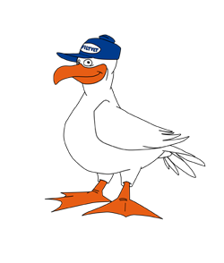

# ⚠️ This repo has been archived. See new repo at https://github.com/feriekolonien/site

> Repository for Feriekoloniens CMS (powered by Sanity.io)

This project backs most content (soon to be) available on [feriekolonien.no](http://feriekolonien.no/)

### Prerequisites

Here's a what you need to get started:

1. Access to [the dataset](https://manage.sanity.io/). Ask @rix1 for access.

### Getting started

```sh
npm install -g @sanity/cli

git clone git@github.com:feriekolonien/cms.git
cd cms && yarn install
```

This will install the sanity command line interface globally, clone the repo and install dependencies.

```sh
yarn dev # this starts the studio and connects it to the development dataset
```

### Developing

Edit schemas in this repository to create new content types.
Add content using the online editor Sanity Studio available on [feriekolonien.sanity.studio/](https://feriekolonien.sanity.studio/).

### Built With

Sanity.io and React

### Building and deploying

Sanity.io hosts both the Studio and the dataset for us. To build and deploy the Studio:

```shell
sanity deploy
```

This builds and uploads the built files to Sanity's own servers. After a while it will be available on [feriekolonien.sanity.studio/](https://feriekolonien.sanity.studio/).

### Licensing

[MIT Licence](https://github.com/feriekolonien/cms/blob/master/LICENSE)
